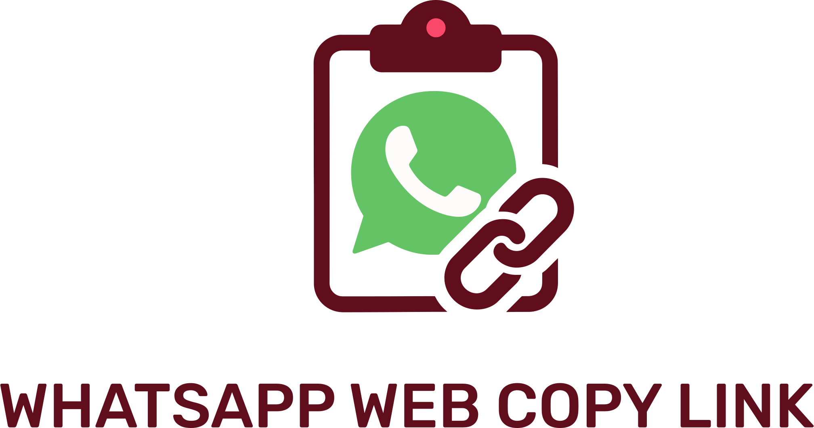
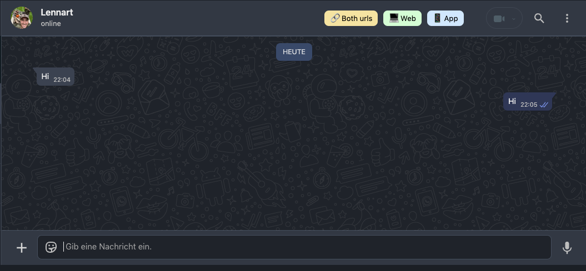

<picture>
  <source media="(prefers-color-scheme: dark)" srcset="images/logo_dark.svg" width="300">
  <source media="(prefers-color-scheme: light)" srcset="images/logo_light.svg" width="300">
  
</picture>

<h3 align="center">
	Chrome addon, that lets you copy
and paste WhatsApp Web URLs to
specific chats, so you can snooze
them and clean up your Whatsapp inbox.
</h3>

## 🚀 Installation 

- Option 1: Install directly from the [Chrome Web Store](https://chromewebstore.google.com/detail/whatsapp-web-copy-url/aclcelbdcmiklepkkgccaldkmehkmjdn)
- Option 2: Download this repository and load it as an unpacked extension in Chrome.

## 🔥 Usage 

This addon will create 3 buttons in the whatsapp web app.

If a whatsapp number is "+491759928165", then the following urls will be copied:
- 📱 App: https://wa.me/491759928165 
- 💻 Web: https://web.whatsapp.com/send?phone=491759928165

Because sometines you don't know what you will need / use in the feature - therefore I added a button "🔗 Both" so you can save both urls in your notes app.
- 🔗 Both urls will create a text: 
     "https://wa.me/491759928165 / https://web.whatsapp.com/send?phone=491759928165"

*(Both App and Web work on iOS and Macbook. Not tested on Windows or Android yet).*

## 🤝  Found a bug? Missing a specific feature?
Feel free to file a new <a href="https://github.com/lennarto/whatsapp-web-copy-link/issues" target="_blank">Issue</a>.

## 💙 Support 
##### 🤝 Contact me
I love building digital products, working in it-strategy, or applying ai in real-world use cases. On top of that, i create private it expert reports (🇩🇪 IT-Gutachten) for legal proceedings in germany, especially in criminal cases.
👉 [My website](https://lennie.de) 👈

##### 🍻 Buy me a beer 

If you’ve found something useful, feel free to fuel my next project with a Beer! 🍻 I do have a couple of cool ideas in my backlog 🚀
👉 [My Paypal](https://www.paypal.com/paypalme/ltoertzen) 👈